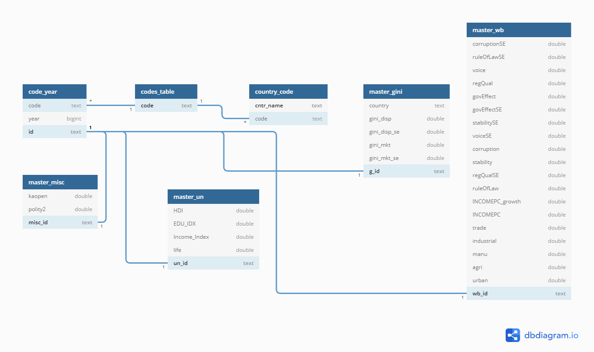

# Data Management and Analysis Project

## 1. Documentation

### HOW TO RUN
All outputs are displayed in notebooks, however, to test you must have credentials to make access string for engine. I have used an init.txt file and I read it as json. So, to test, create a txt file in json format like so (without the <>):

{
"username": "<your_username>",
"password": "<your_password>",
"hostname": "<your_host>",
"database": "<your_database>"
}

Once you have made this file, this notebooks are to be run in the following order:

* [InequalitySelectingFrame](InequalitySelectingFrame.ipynb)
* [DataConsolidation](DataConsolidation.ipynb)
* [Analysis](Analysis.ipynb)
* (optional) [generateDocs](GenerateDocs.ipynb)


### Project Description

The project aims to analyze inequality in countries and how it is related to other economic indicators. 

### Data Source or Description of Data 

Data is taken from a variety of sources in different formats and the unified on a country-year basis. Data comes from the world bank, the United Nations, and Econometric Inequality indices. For sources and description of each column see the next documentation table. 

### Field and / or Columns and Their Types

* First our numerical columns
```
+----+-----------------+------------+----------+--------------------------------------------------------+--------------------------------------------------------------------------------------------------------------------------------------------------------------------------------------------------------------------------------------------------------------------------------------------------------------------------------------------------------------------------------------------------------------------------------------------------------------------------------------------------------------------------------------------------------------------------------------------------------------+-------------------+
|    |    VariableName |       Mean |    Range |                                                 source | description                                                                                                                                                                                                                                                                                                                                                                                                                                                                                                                                                                                                  | units             |
|----+-----------------+------------+----------+--------------------------------------------------------+--------------------------------------------------------------------------------------------------------------------------------------------------------------------------------------------------------------------------------------------------------------------------------------------------------------------------------------------------------------------------------------------------------------------------------------------------------------------------------------------------------------------------------------------------------------------------------------------------------------+-------------------|
| 0  | gini_disp       | 38.9512    | 42.8     | https://fsolt.org/swiid/swiid_source/                  | The GINI Index is a measure of the deviation of the distribution of income among individuals or households within a country from a perfectly equal distribution. A value of 0 represents absolute equality, a value of 100 absolute inequality. Gini_disp considers only disposable income as income.  Disposable income, in turn, is gross income minus direct taxes: ‘post-tax, post-transfer’ income.                                                                                                                                                                                                     | index             |
| 1  | gini_disp_se    | 1.58964    | 5.3      | https://fsolt.org/swiid/swiid_source/                  | The standard error of gini_disp                                                                                                                                                                                                                                                                                                                                                                                                                                                                                                                                                                              | index             |
| 2  | gini_mkt        | 46.7566    | 42.2     | https://fsolt.org/swiid/swiid_source/                  | The GINI Index is a measure of the deviation of the distribution of income among individuals or households within a country from a perfectly equal distribution. A value of 0 represents absolute equality, a value of 100 absolute inequality. Gini_mkt considers market income. Market income is defined as the amount of money coming into the household, excluding any government cash or near-cash benefits, the so-called ‘pretax, pre-transfer’ income.                                                                                                                                               | index             |
| 3  | gini_mkt_se     | 2.1245     | 7.1      | https://fsolt.org/swiid/swiid_source/                  | The standard deviation if gini_mkt                                                                                                                                                                                                                                                                                                                                                                                                                                                                                                                                                                           | index             |
| 4  | corruptionSE    | 0.283035   | 0.453911 | https://info.worldbank.org/governance/wgi/             | Standard error of Corruption.                                                                                                                                                                                                                                                                                                                                                                                                                                                                                                                                                                                | index             |
| 5  | ruleOfLawSE     | -0.0820307 | 4.70672  | https://info.worldbank.org/governance/wgi/             | Standard error of rule of law.                                                                                                                                                                                                                                                                                                                                                                                                                                                                                                                                                                               | index             |
| 6  | voice           | -0.0474092 | 4.88285  | https://info.worldbank.org/governance/wgi/             | Voice and accountability captures perceptions of the extent to which a country's citizens are able to participate in selecting their                                                                                                                                                                                                                                                                                                                                                                                                                                                                         | index             |
|    |                 |            |          |                                                        | government, as well as freedom of expression, freedom of association, and a free media.                                                                                                                                                                                                                                                                                                                                                                                                                                                                                                                      |                   |
| 7  | regQual         | -0.0656282 | 4.33871  | https://info.worldbank.org/governance/wgi/             | Regulatory quality captures perceptions of the ability of the government to formulate and implement sound policies and regulations that                                                                                                                                                                                                                                                                                                                                                                                                                                                                      | index             |
|    |                 |            |          |                                                        | permit and promote private sector development.                                                                                                                                                                                                                                                                                                                                                                                                                                                                                                                                                               |                   |
| 8  | govEffect       | 0.180658   | 0.583809 | https://info.worldbank.org/governance/wgi/             | Government effectiveness captures perceptions of the quality of public services, the quality of the civil service and the degree                                                                                                                                                                                                                                                                                                                                                                                                                                                                             | index             |
|    |                 |            |          |                                                        | of its independence from political pressures, the quality of policy formulation and implementation, and the credibility of the                                                                                                                                                                                                                                                                                                                                                                                                                                                                               |                   |
|    |                 |            |          |                                                        | government's commitment to such policies.                                                                                                                                                                                                                                                                                                                                                                                                                                                                                                                                                                    |                   |
| 9  | govEffectSE     | 0.215546   | 0.362391 | https://info.worldbank.org/governance/wgi/             | Standard error of government effectiveness.                                                                                                                                                                                                                                                                                                                                                                                                                                                                                                                                                                  | index             |
| 10 | stabilitySE     | -0.0413185 | 4.06015  | https://info.worldbank.org/governance/wgi/             | Standard error of stability.                                                                                                                                                                                                                                                                                                                                                                                                                                                                                                                                                                                 | index             |
| 11 | voiceSE         | 0.190857   | 0.445928 | https://info.worldbank.org/governance/wgi/             | Standard error of voice.                                                                                                                                                                                                                                                                                                                                                                                                                                                                                                                                                                                     | index             |
| 12 | corruption      | 0.162245   | 0.28389  | https://info.worldbank.org/governance/wgi/             | Control of corruption captures perceptions of the extent to which public power is exercised for private gain, including both petty and grand                                                                                                                                                                                                                                                                                                                                                                                                                                                                 | index             |
|    |                 |            |          |                                                        | forms of corruption, as well as "capture" of the state by elites and private interests.                                                                                                                                                                                                                                                                                                                                                                                                                                                                                                                      |                   |
| 13 | stability       | -0.0467297 | 4.90558  | https://info.worldbank.org/governance/wgi/             | Political Stability and Absence of Violence/Terrorism measures perceptions of the likelihood of political instability and/or politicallymotivated violence, including terrorism.                                                                                                                                                                                                                                                                                                                                                                                                                             | index             |
| 14 | regQualSE       | -0.0897738 | 5.07504  | https://info.worldbank.org/governance/wgi/             | Standard error of regQual.                                                                                                                                                                                                                                                                                                                                                                                                                                                                                                                                                                                   | index             |
| 15 | ruleOfLaw       | 0.217252   | 0.559417 | https://info.worldbank.org/governance/wgi/             | Rule of law captures perceptions of the extent to which agents have confidence in and abide by the rules of society, and in particular the                                                                                                                                                                                                                                                                                                                                                                                                                                                                   | index             |
|    |                 |            |          |                                                        | quality of contract enforcement, property rights, the police, and the courts, as well as the likelihood of crime and violence.                                                                                                                                                                                                                                                                                                                                                                                                                                                                               |                   |
| 16 | INCOMEPC_growth | 2.58672    | 184.158  | https://data.worldbank.org/indicator/NY.GDP.PCAP.KD.ZG | Annual percentage growth rate of GDP per capita based on constant local currency. Aggregates are based on constant 2010 U.S. dollars. GDP per capita is gross domestic product divided by midyear population. GDP at purchaser's prices is the sum of gross value added by all resident producers in the economy plus any product taxes and minus any subsidies not included in the value of the products. It is calculated without making deductions for depreciation of fabricated assets or for depletion and degradation of natural resources.                                                           | percentGDP        |
| 17 | INCOMEPC        | 10420.5    | 102947   | https://data.worldbank.org/indicator/NY.GDP.PCAP.CD    | GDP per capita is gross domestic product divided by midyear population. GDP is the sum of gross value added by all resident producers in the economy plus any product taxes and minus any subsidies not included in the value of the products. It is calculated without making deductions for depreciation of fabricated assets or for depletion and degradation of natural resources. Data are in current U.S. dollars.                                                                                                                                                                                     | current USD       |
| 18 | trade           | 86.9558    | 442.593  | https://data.worldbank.org/indicator/NE.TRD.GNFS.ZS    | Trade is the sum of exports and imports of goods and services measured as a share of gross domestic product.                                                                                                                                                                                                                                                                                                                                                                                                                                                                                                 | percentGDP        |
| 19 | industrial      | 26.6213    | 85.7237  | https://data.worldbank.org/indicator/NV.IND.TOTL.ZS    | Industry corresponds to ISIC divisions 10-45 and includes manufacturing (ISIC divisions 15-37). It comprises value added in mining, manufacturing (also reported as a separate subgroup), construction, electricity, water, and gas. Value added is the net output of a sector after adding up all outputs and subtracting intermediate inputs. It is calculated without making deductions for depreciation of fabricated assets or depletion and degradation of natural resources. The origin of value added is determined by the International Standard Industrial Classification (ISIC), revision 3 or 4. | value_percent_GDP |
| 20 | manu            | 12.5977    | 50.4047  | https://data.worldbank.org/indicator/NV.IND.MANF.ZS    | Manufacturing refers to industries belonging to ISIC divisions 15-37. Value added is the net output of a sector after adding up all outputs and subtracting intermediate inputs. It is calculated without making deductions for depreciation of fabricated assets or depletion and degradation of natural resources. The origin of value added is determined by the International Standard Industrial Classification (ISIC), revision 3. Note: For VAB countries, gross value added at factor cost is used as the denominator.                                                                               | value_percent_GDP |
| 21 | agri            | 12.838     | 79.0114  | https://data.worldbank.org/indicator/NV.AGR.TOTL.ZS    | Agriculture corresponds to ISIC divisions 1-5 and includes forestry, hunting, and fishing, as well as cultivation of crops and livestock production. Value added is the net output of a sector after adding up all outputs and subtracting intermediate inputs. It is calculated without making deductions for depreciation of fabricated assets or depletion and degradation of natural resources. The origin of value added is determined by the International Standard Industrial Classification (ISIC), revision 3 or 4.                                                                                 | value_percent_GDP |
| 22 | urban           | 54.2602    | 92.588   | https://data.worldbank.org/indicator/SP.URB.TOTL.IN.ZS | Urban population refers to people living in urban areas as defined by national statistical offices. The data are collected and smoothed by United Nations Population Division.                                                                                                                                                                                                                                                                                                                                                                                                                               | percent Pop       |
| 23 | HDI             | 0.66384    | 0.716    | http://hdr.undp.org/en/statistics/understanding        | The HDI was created to emphasize that people and their capabilities should be the ultimate criteria for assessing the development of a country, not economic growth alone.                                                                                                                                                                                                                                                                                                                                                                                                                                   | index             |
|    |                 |            |          |                                                        |     The Human Development Index (HDI) is a summary measure of average achievement in key dimensions of human development: a long and healthy life, being knowledgeable and have a decent standard of living. The HDI is the geometric mean of normalized indices for each of the three dimensions.                                                                                                                                                                                                                                                                                                           |                   |
| 24 | EDU_IDX         | 0.596255   | 0.84     | http://hdr.undp.org/en/statistics/understanding        | Education index is an average of mean years of schooling (of adults) and expected years of schooling (of children), both expressed as an index obtained by scaling with the corresponding maxima.                                                                                                                                                                                                                                                                                                                                                                                                            | index             |
| 25 | Income_Index    | 0.65826    | 0.877    | http://hdr.undp.org/en/statistics/understanding        | GNI per capita (2011 PPP International $, using natural logarithm) expressed as an index using a minimum value of $100 and a maximum value $75,000                                                                                                                                                                                                                                                                                                                                                                                                                                                           | index             |
| 26 | life            | 68.8097    | 48.1     | http://hdr.undp.org/en/statistics/understanding        | Number of years a newborn infant could expect to live if prevailing patterns of age-specific mortality rates at the time of birth stay the same throughout the infant’s life.                                                                                                                                                                                                                                                                                                                                                                                                                                | years             |
| 27 | kaopen          | 0.265516   | 4        | http://web.pdx.edu/~ito/Chinn-Ito_website.htm          | The Chinn-Ito index (KAOPEN) is an index measuring a country's degree of capital account openness. The index was initially introduced in Chinn and Ito (Journal of Development Economics, 2006). KAOPEN is based on the binary dummy variables that codify the tabulation of restrictions on cross-border financial transactions reported in the IMF's Annual Report on Exchange Arrangements and Exchange Restrictions (AREAER).                                                                                                                                                                            | index             |
| 28 | polity2         | 3.91655    | 20       | http://www.systemicpeace.org/inscrdata.html            | Annual, cross-national, time-series and polity-case formats coding democratic and autocratic "patterns of authority" and regime changes in all independent countries with total population greater than 500,000 in 2018.                                                                                                                                                                                                                                                                                                                                                                                     | index             |
| 29 | constant        | 1          | 0        | nothing                                                | Bias term to aid in regression and predicitive analysis. Just a vector of 1s.                                                                                                                                                                                                                                                                                                                                                                                                                                                                                                                                | constant          |
+----+-----------------+------------+----------+--------------------------------------------------------+--------------------------------------------------------------------------------------------------------------------------------------------------------------------------------------------------------------------------------------------------------------------------------------------------------------------------------------------------------------------------------------------------------------------------------------------------------------------------------------------------------------------------------------------------------------------------------------------------------------+-------------------+
```

Docs generated with assistance of [python notebook](GenerateDocs.ipynb): 

### Selecting an appropriate time frame

We are primarily concerned with inequality, and we want contiguous data. Holes are okay, but we do not want to include, say, year 1965 if there is data for 3 countries in it - it is not statistically sound. So to appropriately pick a solid baseline range, I used seaborn and pandas to visualize data availability in [InequalitySelectingFrame](InequalitySelectingFrame.ipynb)
(This is also one of my new technologies used (I mention it again in the section))

While the notebook is commented and contains info, the basics are:
* See how many countries are available for each year of the data
* Pick an appropriate year range
* Visualize data availability in said range
* Repeat steps 2-4 as needed. 

The final visualization of the data is in [InequalitySelectingFrame](InequalitySelectingFrame.ipynb) last cell.

### Design motivation

The design is a bit non-standard. Since we have data from 4 different main sources, I have 4 different tables for each source. For instance master_un contains the 4 fields from the United Nations data sources. This makes sense as each source has its own range and format of data. However, as a primary key each table has an id which is in format <countrycode>_<year>. All of these are 1 to 1 related to a table called code_year, which has each id's associated year and country code. code_year in turn is related 1-to-1 to a codes table. This could likely have been ommitted but just in case country names change or we add say geographical data unique to country, this is kept. code in turn has a many to 1 relationship with table country_code, which tells which country names correspond to which codes. Because of different data sources, there are different country names, but codes stay the same. For instance the world bank calls Hong Kong, Hong Kong, but the UN calls it Hong Kong, China.  

## 2. Diagram / Sample Documents and Collections



## 3. Data Import and Collection

Data cleaning is an enormous part of this project. One can follow [DataConsolidation](DataConsolidation.ipynb) for full step by step commented transformations, cleaning, and import. but I will summarize here.

* Build a dictionary by going in each source and mapping a country name to a code. This is done with the assistance of a country_code csv and some googling. 
* We then construct inequality dataframe which has country, code, year, and the data corresponding to each country, year pair
* We fill out indices. For instance if there is no data on USA in 2009, we still want it as an index with NaNs because we want to be able to merge it with similarly indexed dataframes which might have data in those fields. 
* Construct tables for world bank, United Nations, and Misc.
* Make several other dataframes to put into SQL - namely code_year, country_code, and code_table
* Make the code_year id that will serve as each column's primary key.
* Use SQLAlchemy to make an engine instance. 
* Convert each of our dtaframes directly to SQL using the to_sql command.
* Add the appropriate primary and foreign key constraints 

[Link to import/clean/combine script](DataConsolidation.ipynb)

## 4. Analysis

We want to see what affects inequality, and how inequalityinteracts with other economic indicators, as well as see which countries are most affected by inequality.


[Link to analysis script](Analysis.ipynb)

